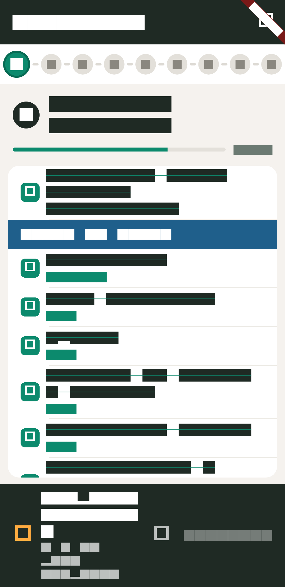

# Tecnam P92 Echo — Pre-flight Checklist (EC-DG4)

A **Flutter** mobile checklist app for the pre- and post-flight phases of the
**Tecnam P92 Echo** (registration EC-DG4), faithfully transcribed from the
ULR (ultralight) training organisation dossier. Built for the pilot in the
cockpit: large tap targets, section-by-section navigation, and a hard
take-off gate that enforces the cardinal rule of the operation.

> **The one hard rule:** *You are not allowed to take off until the whole
> checklist is checked.*

The app enforces this with a **take-off gate** pinned to the bottom of the
screen: while any item remains unchecked, the **DESPEGAR** (take off) button
stays locked and shows how many items are still pending. The flight only
advances to the landing phase once every pre-take-off item — across blocks
1–7 — is complete.



> 📹 [Watch the app demo video](docs/app_demo.mp4) — walk through the flight flow.


---

## Highlights

- **9 flight blocks** transcribed from the dossier, driven by a single
  source-of-truth data file (`lib/data/checklist_data.dart`).
- **Multi-page flow** (one screen per block) with a top **step indicator**
  and a progress bar — no prev/next buttons, so every block keeps its full
  vertical space for the items.
- **Hard take-off gate**: locked DESPEGAR until blocks 1–7 are done; then a
  two-phase gate that switches to **ATERRIZADO** (landed) for the landing
  phase.
- **Live altimeter (QNH)** pulled from the nearest reachable airport's real
  **METAR**, shown inline in the ALTÍMETRO item ("LEBT 1021 hPa").
  Fail-closed: no value is shown if no live data is available.
- **Local persistence** — progress survives app restarts.
- **Reset with confirmation**, an engine-parameters reference modal, and a
  jump-to-first-pending shortcut.
- **20 automated tests** (data integrity, gate logic, METAR parsing).

---

## Tech stack

| Area        | Choice                                                              |
|-------------|---------------------------------------------------------------------|
| Framework   | Flutter (Dart)                                                      |
| Target      | Android (APK release build)                                         |
| State       | `ChangeNotifier` + `ListenableBuilder` (no external state lib)      |
| Persistence | `shared_preferences`                                                |
| Networking  | `package:http` → public **[VATSIM METAR](https://metar.vatsim.net)** endpoint |
| Testing     | `flutter_test` + `http/testing` (mocked HTTP)                       |

---

## Quick start

```bash
# Get dependencies
flutter pub get

# Run on a connected device / emulator
flutter run

# Analyse, test, and build the release APK
flutter analyze
flutter test
flutter build apk --release
```

The release APK is written to
`build/app/outputs/flutter-apk/app-release.apk`.

---

## Documentation

For the full picture, see the in-depth guides under [`docs/`](docs/):

| Document                                  | Covers |
|-------------------------------------------|--------|
| [**Overview & Goal**](docs/overview.md)    | Purpose, pilot use-case, product goals |
| [**Architecture**](docs/architecture.md)  | Folder layout, layers, data flow, state, screens |
| [**Flight data model**](docs/data.md)      | The 9 blocks, items, headers, notes, checklist structure |
| [**Live METAR / altimeter**](docs/metar.md)| How the QNH is fetched, fallback logic, API used |
| [**UI & theming**](docs/ui.md)             | Screens, widgets, the cream/green design system |
| [**Testing**](docs/testing.md)             | What is tested and how |

---

## Project structure

```
lib/
  main.dart                      # App entry point
  data/checklist_data.dart       # The full checklist (source of truth)
  models/
    checklist_item.dart          # Item model (label, note, header flag)
    checklist_group.dart         # Block model (title, step, items)
  state/
    checklist_store.dart         # Checked state, persistence, gate logic
    metar_notifier.dart          # Live QNH/METAR state (ChangeNotifier)
  services/
    metar_service.dart           # METAR fetch + parsing (http)
  screens/checklist_screen.dart  # Main multi-page screen
  theme/app_theme.dart           # Cream/green design system
  widgets/
    step_indicator.dart          # Top block navigator
    block_view.dart              # One block (title + items, scrollable)
    item_row.dart                # Single checklist item (tap to check)
    progress_bar.dart            # Per/general progress
    takeoff_gate.dart            # The locked take-off/landing gate
test/
  checklist_data_test.dart       # Data integrity
  checklist_store_test.dart      # Gate + toggle + reset logic
  metar_service_test.dart        # METAR parsing + fallback
  screenshot_test.dart           # Golden-image README screenshot
```

---

## License & data provenance

The checklist content is transcribed from the operator's training dossier
(ULR training organisation) for personal operational use. The METAR data is
sourced from the public VATSIM METAR service, which provides unauthenticated
real-world aviation weather reports.
